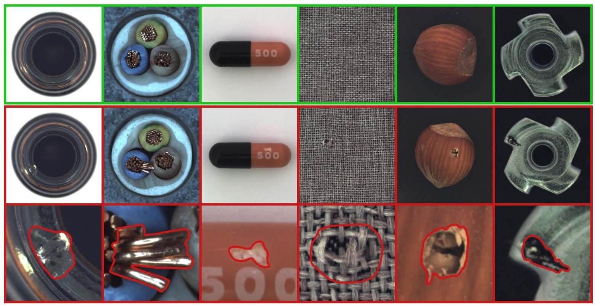

# InspectorsAlly

## Boost Your Quality Control with InspectorsAlly - The Ultimate AI-Powered Inspection App

InspectorsAlly is a powerful AI-powered application designed to help businesses streamline their quality control inspections. With InspectorsAlly, companies can ensure that their products meet the highest standards of quality, while reducing inspection time and increasing efficiency.

This advanced inspection app uses state-of-the-art computer vision algorithms and machine learning models to perform visual quality control inspections with unparalleled accuracy and speed. InspectorsAlly is capable of identifying even the slightest defects, such as scratches, dents, discolorations, and more.

InspectorsAlly is easy to use, with a simple and intuitive interface that allows users to set up their inspection criteria quickly and easily. The application can be customized to fit the specific needs of any industry, with the ability to set inspection thresholds and adjust parameters as needed.

With InspectorsAlly, businesses can optimize their quality control process and ensure that their products meet the highest standards of quality. Say goodbye to time-consuming and error-prone manual inspections and hello to faster, more accurate, and more efficient quality control inspections with InspectorsAlly.

<br>
<hr>
<br>

## ⭐ Anomaly Detection Dataset 

> ### ⭐ Dataset Download Link: https://www.mvtec.com/company/research/datasets/mvtec-ad
This is a 400-image dataset, that contains images of good items (labeled as class ‘Good’) and items with a defect (labeled as class ‘Anomaly’). Dataset is imbalanced — with more samples of good images than defective ones. Item in the image may be literally of any type and complexity — bottle, cable, pill, tile, leather, zipper, etc. Below is an example of how the dataset may look like.



<br>
<hr>
<br>

## ⭐ Development References:
1. https://www.analyticsvidhya.com/blog/2021/06/transfer-learning-using-vgg16-in-pytorch/
2. https://blog.paperspace.com/vgg-from-scratch-pytorch/

<br>
<hr>
<br>

## ⭐ Streamlit Deployment Configurations:
```
[theme]
base="dark"

[browser]
gatherUsageStats = false
```
<br>
<hr>
<br>

## ⭐ Deployment References:
1. https://30days.streamlit.app/
2. https://docs.streamlit.io/streamlit-community-cloud/get-started/deploy-an-app
3. https://streamlit-cloud-example-apps-streamlit-app-sw3u0r.streamlit.app/?hsCtaTracking=28f10086-a3a5-4ea8-9403-f3d52bf26184|22470002-acb1-4d93-8286-00ee4f8a46fb
4. https://docs.streamlit.io/library/advanced-features/configuration

